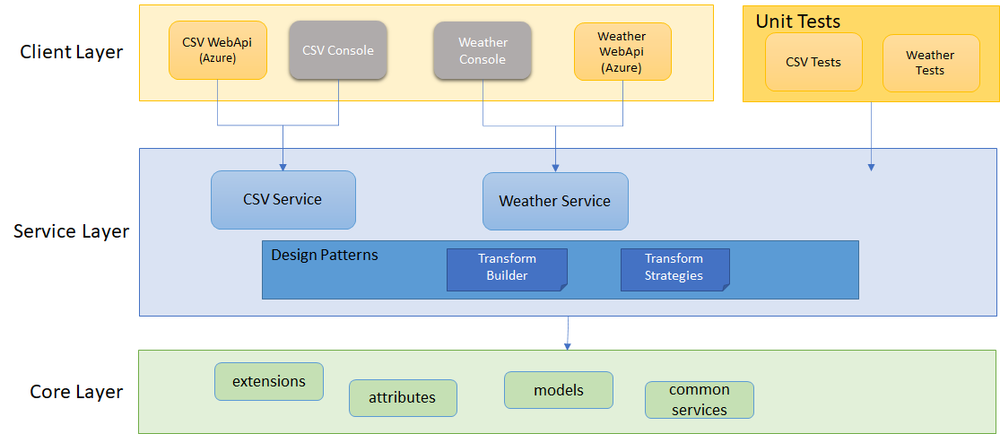

# Application Exercises

# Technical Features

1. Back-end & console apps are built with .NET 5;
2. xUnit for .NET Unit Testing;

Here's the high level architecture:

# How to Run APIs
## 1. Deploy to local IIS
The artifact(s) generated by Github should be ready for deployments on local IIS:
1. Navigate to https://github.com/DerekJi/AppExercises/actions
2. Select the latest workflow run. For example: https://github.com/DerekJi/AppExercises/actions/runs/846931647
3. Scroll down to the bottom, and download zipped Artifact file `.net-app`;
4. Extract it to your local directory which is used for the IIS web site.

## 2. Deployed Azure App Service
Please refer to the sections `Test Urls` as below.

## 3. Launch in local dev env.
0. Launch a command console or git bash console, and make sure `git` has been installed properly;
1. Run `git pull https://github.com/DerekJi/AppExercises.git` to clone this repo;
2. Run `cd AppExercises` to enter the repo;
3. Run `cd AppEx.Api` to enter the API project;
4. Run `dotnet run` to launch;
5. Navigate to https://localhost:5001/swagger/ to test APIs;

# How to Run Console Apps
## 1. Run CSV Console App
0. Launch a windows cmd console;
1. Enter the project `AppEx.Csv.ConsoleCli`;
2. Run command `dotnet build`;
3. Run command `cd bin\Release\netcoreapp3.1`;
4. Run command `dotnet AppEx.Csv.ConsoleCli.dll`;
5. Follow the instructions

## 2. Run Weather Console App
0. Launch a windows cmd console;
1. Enter the project `AppEx.Weather.ConsoleCli`;
2. Run command `dotnet build`;
3. Run command `cd bin\Release\netcoreapp3.1`;
4. Run command `dotnet AppEx.Weather.ConsoleCli.dll`;
5. Follow the instructions

***
# Background
There are 3 exercises in this repo:
## 1. CSV Read & Write
### 1.1. Requirements
Write a C#. NET application which does the following:

1.	Read in the CSV file from: https://apps.waterconnect.sa.gov.au/file.csv
2.	Remove the column “Unit_No”
3.	Add a new column with the label “calc”
4.	Set the value of the new column as the sum of the columns “swl” and “rswl”
5.	Save the new CSV file to the file system

> Solution requirements:
>-	The solution must be .NET C# (can be a web application, console app etc)

### 1.2. Solution
1. Layered Architecture
2. Transform Strategies to 
   - remove columns
   - add new columns
3. Configurable removed columns;
4. Configurable new columns (sum);
5. Use `ExpandoObject` for flexible data processing;
6. `CsvService` is responsible for business logic, and supports different consumers (console/web);
7. Provides both console & web apps as service consumers;

### 1.3. Test Urls
* https://app-exercises.azurewebsites.net/api/v1/csv/WaterConnect

## 2. Weather ConsoleApp
### 2.1. Requirements
Write a C# program that consumes Bureau of Meteorology weather observation data for the Adelaide Airport weather observation station, and calculates the average temperature from this data for the previous 72 hours.

The data is available at http://www.bom.gov.au/products/IDS60901/IDS60901.94672.shtml,
OR
the JSON feed for this data is available at http://www.bom.gov.au/fwo/IDS60901/IDS60901.94672.json.

> Solution requirements:
> -	The solution must be an ASP.NET C# **console** application (.NET Framework or .NET Core) that outputs the calculated average temperature.

### 2.2. Solution
1. Layered Architecture
2. Reuse `WeatherService` created by Task3 (as below) to reduce workload;
3. Provide method `AverageTemperature` with optional argument `hours` to be open to possible changes (past 48 hours?);

## 3. Weather WebApp
### 3.1. Requirements
Create a C# web service that provides weather observation data for any requested weather observation station in the Adelaide Area.

A sample table of four weather observation stations follows below.
The data formats available for each are constructed using the following patterns:
* <a>http://www.bom.gov.au/products/IDS60901/IDS60901.{WMO}.shtml</a>
* <a>http://www.bom.gov.au/fwo/IDS60901/IDS60901.{WMO}.json</a>

Weather Observation Station |	WMO
--- | ---
Adelaide Airport | 94672
Edinburgh	| 95676
Hindmarsh Island | 94677
Kuitpo | 94683

> Solution requirements:
> -	The web service API shall be able to fetch all weather observation data for any weather observation station.
> -	The web service API shall be able to fetch a specific piece of weather observation data (e.g. Temp, App Temp, Dew Point etc.) for any weather observation station.
> -	The solution must be a RESTful HTTP service, ASP.NET web application, API project (.NET Framework or .NET Core) deployable to IIS web server.
> -	Please provide a short paragraph explaining your solution

### 3.2. Technical Solution
1. Layered Architecture
2. Reuse `RemoveColumnsStrategy` created in Task1 for fields filtering;
3. Use `wmo` (query param "stationId") as the resource name in REST API;
4. Support query param `fields` so that the results could be filtered with specified fields only;
5. Use `ExpandoObject` for flexible data processing;
6. `WeatherService` is responsible for business logic, and supports different consumers (console/web);
7. Provides web app (deployed to Azure) as service consumers;

### 3.3. Test Urls
- Fetch all weather observation data from any station:
  * https://app-exercises.azurewebsites.net/api/v1/weather/94672
  * https://app-exercises.azurewebsites.net/api/v1/weather/95676
- Fetch a specific piece of weather observation data from any station
  * https://app-exercises.azurewebsites.net/api/v1/weather/94672?fields=sort_order,air_temp
  * https://app-exercises.azurewebsites.net/api/v1/weather/94672?fields=sort_order,wind_spd_kmh

